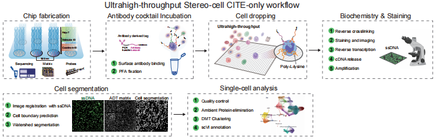

# Stereo-seq-CITE Analysis

Analysis code for Stereo-cell-CITE data processing and visualization.

## Overview

This repository contains Jupyter notebooks for:

- **Cell clustering and annotation** ([notebooks/s01_annotation.ipynb](notebooks/s01_annotation.ipynb))
- **Figure generation and statistical analysis** ([notebooks/s02_figures.ipynb](notebooks/s02_figures.ipynb))

## Workflow

The figure below illustrates the overall analysis workflow:



*Figure 1: Schematic overview of the Stereo-seq-CITE data analysis pipeline. The workflow encompasses data preprocessing, quality control, normalization, cell clustering, annotation, and downstream visualization.*

## Environment Setup

```bash
# Install dependencies
pip install scanpy anndata numpy pandas matplotlib seaborn scikit-learn umap-learn
```

## Data

Raw sequencing data are available at [GNCB accession number].

Processed data files (`.h5ad`) should be placed in the `data/` directory before running the notebooks.

## Citation

If you use this code, please cite:

> [Your paper citation]

## Contact

For questions about the analysis, please open an issue or contact [zhuqianhua@genomics.cn].
